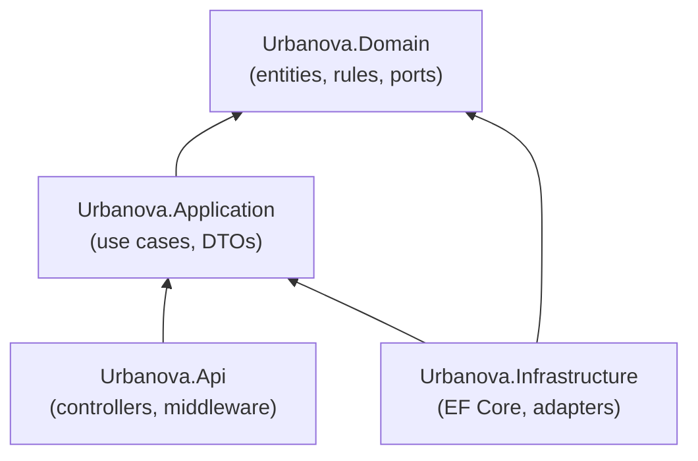
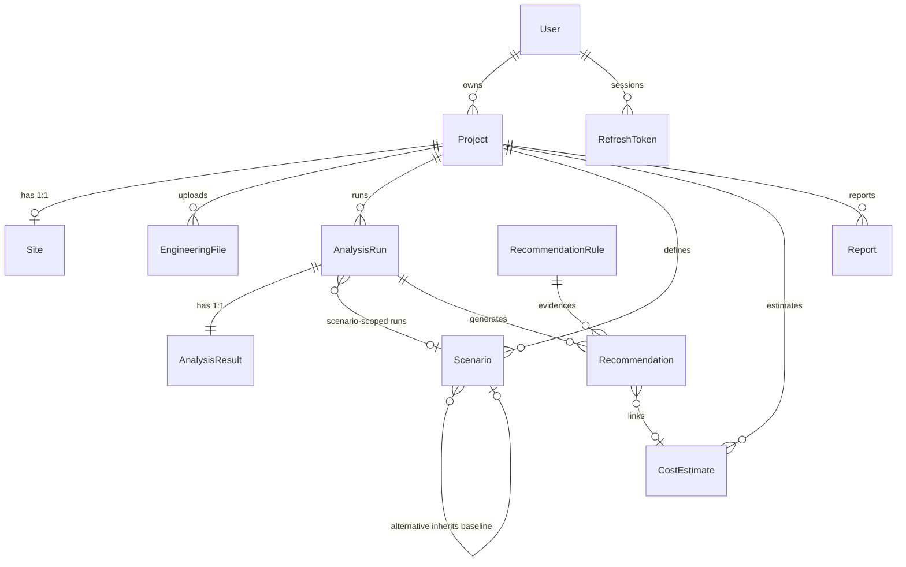
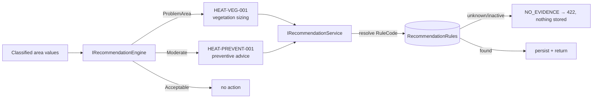
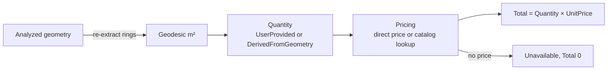
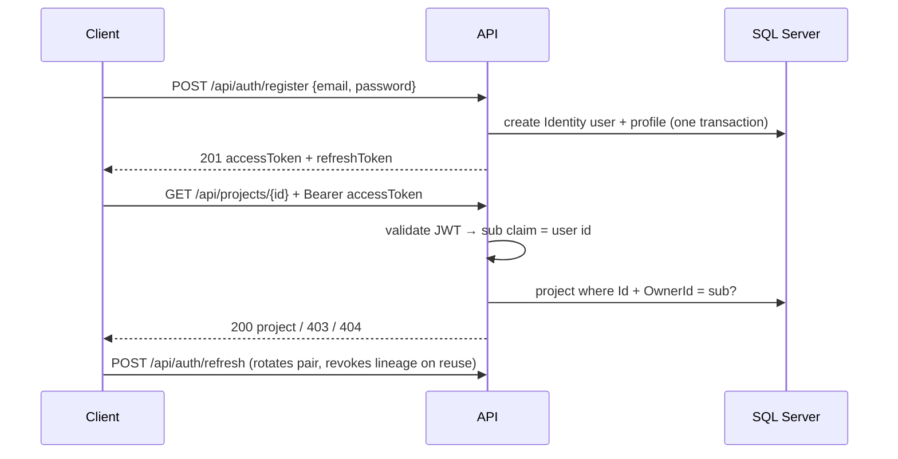

# URBANOVA
AI-powered Urban Climate & Site Intelligence Platform  
Grow Cooler Cities, One Decision at a Time.

[](https://github.com/AbdulrahmanTawhed/Urbanova/actions/workflows/ci.yml)
[](LICENSE)

---

## 1. Project Overview

**Urbanova** is a decision-support platform for urban heat analysis. It helps real estate
developers, consulting firms, and engineers analyze a site before and during design, and
make design decisions based on data instead of experience or manual estimation alone.

**Problem it solves:** Urban Heat Island risk and outdoor discomfort are hard to quantify
early in design. Teams rely on rules of thumb or expensive on-site measurement, so
mitigations (green cover, shading, material changes) are chosen without evidence of
their expected impact or cost.

**Purpose of this repository:** the production-quality **backend** for the Urbanova MVP —
a REST API plus business logic, relational storage, and authentication that carries a
project from an uploaded engineering file through environmental analysis, scenarios,
evidence-based recommendations, cost estimation, and reporting.

**Designed for:**
- Backend developers joining the project (Clean Architecture, fully tested).
- Reviewers evaluating the system's design and implementation quality.
- Frontend clients consuming the REST API (see [API Overview](#6-api-overview)).

> Status: **PRD v0.2 compliant, MVP Backend ready with documented limitations** — all modules built, **265/265 tests green**
> (145 unit + 120 integration, 0 failed, 0 skipped). Every unresolved PRD requirement maps to an abstraction
> plus a configurable MVP default documented in `docs/assumptions.md`. Placeholders are estimates, never validated facts.

---

## 2. What We Are Building

A user works through the system in this order (each step is a real, implemented API
capability):

```mermaid
flowchart LR
    A[Register / Login] --> B[Create project]
    B --> C[Upload GeoJSON file]
    C --> D[Validate + extract geometry]
    D --> E[Run heat analysis]
    E --> F[Create locked baseline]
    F --> G[Create alternative + edit 1-3 parameters]
    G --> H[Re-analyze + compare]
    H --> I[Evidence-based recommendations]
    I --> J[Cost estimates]
    J --> K[JSON / HTML report]
```



1. **Authentication** — register, log in (JWT access token), refresh rotated tokens.
2. **Project management** — create projects with site/location data; list, update
   (optimistic concurrency), delete.
3. **File upload** — upload a GeoJSON engineering file; the system detects the format,
   validates structure, extracts metadata, and deduplicates by content hash.
4. **Geometry processing** — extract polygons into a normalized, format-independent
   model with planar areas and bounding boxes.
5. **Environmental analysis** — run the configurable heat engine over the geometry;
   results are classified (Acceptable / Moderate / ProblemArea) and stored as
   reproducible, hash-identified runs.
6. **Scenarios** — freeze a locked baseline, duplicate it into an alternative, edit up
   to 3 approved parameters, and re-analyze deterministically.
7. **Comparison** — diff baseline vs. alternative (parameters, environmental values,
   class transitions, costs, trade-offs).
8. **Recommendations** — rule-based, evidence-graded interventions per problem area.
9. **Costing** — quantity × unit price from direct prices or a price catalog, with
   honest `Unavailable` states; quantities can derive from analyzed polygon areas.
10. **Reporting** — versioned JSON or HTML reports with decision summary and caveats.

---

## 3. Core Features

### Implemented

| Feature | What / why | Handled by |
|---|---|---|
| JWT auth + refresh rotation | Secure per-user access; rotated refresh tokens with reuse detection | `Infrastructure/Auth`, `Api/Controllers/AuthController` |
| Project ownership | Users only ever see their own projects (404/403 split, no leaks) | `MustOwnProject` policy + owner-scoped services |
| Project CRUD + sites | Create/list/update/delete projects with site boundary, CRS, coordinates | `ProjectsController`, `Projects/ProjectService` |
| File upload pipeline | Format detection → validation → metadata → SHA-256 dedupe, 50 MB cap | `FileProcessing/*`, `FilesController` |
| Geometry extraction | GeoJSON → normalized polygons (rings closed, areas, bboxes) | `GeoJsonFileProcessor`, `GeometryService` |
| Heat analysis engine | Config-driven HeatV01: base − veg·k − shade·k + albedo term; reproducible runs | `Analysis/HeatV01Engine`, `AnalysisService` |
| Classification | Configurable Acceptable/Moderate/ProblemArea bands | `ThresholdClassificationService` |
| Scenario parameters | Configurable catalog (keys, units, bands, max 3) with coded errors | `ScenarioParameterOptions/Catalog`, `ScenarioService` |
| Baseline/alternative scenarios | Locked baselines, inheriting alternatives, versioning, re-analysis | `ScenarioService`, `ScenariosController` |
| Comparison | Per-area deltas, transitions, new-problem flags, cost totals, trade-offs | `ComparisonEngine`, `ComparisonService` |
| Rule-based recommendations | Vegetation sizing + preventive advice, evidence registry, `NO_EVIDENCE` blocking | `RuleRecommendationEngine`, `RecommendationService` |
| Cost estimation | Direct/catalog pricing, geometry-derived m² quantities, `Unavailable` states | `FilePriceCatalog`, `CostService` |
| Geodesic areas | Spherical-earth m² for cost derivation (planar deg² never relabeled) | `Domain/ValueObjects/GeodesicAreas` |
| Reporting | Canonical JSON + HTML renderer, decision summary, versioned/hashed rows | `Json/HtmlReportGenerator`, `ReportService` |
| Health checks | Liveness + readiness incl. SQL Server probe | `Program.cs` |
| OpenAPI + Scalar UI | Machine-readable spec + interactive docs (Development) | `Microsoft.AspNetCore.OpenApi`, `Scalar.AspNetCore` |

### Planned / future (not implemented)

- Additional engineering file formats (only **GeoJSON** today: `.geojson`/`.json`).
- Validated engineering thresholds, rules, price feeds, and scientific references
  (current values are documented MVP placeholders).
- PDF reports, background job processing, rate limiting, antivirus scanning.
- Role-based authorization (Identity roles are registered; enforcement is owner-only).
- AI chatbot / user guidance (explicitly separate from the rule-based engine; no AI
  code or dependencies exist in the repo).
- Ellipsoidal geodesy, multi-engine dispatch, Testcontainers test profile.

---

## 4. Architecture

```text
Urbanova
├── src/Urbanova.Domain/          # entities, value objects, enums, ports, business rules
├── src/Urbanova.Application/     # use cases, DTOs, validators, service interfaces
├── src/Urbanova.Infrastructure/  # EF Core, Identity, file/analysis/report adapters
├── src/Urbanova.Api/             # controllers, middleware, auth wiring, OpenAPI
└── tests/                        # Urbanova.UnitTests, Urbanova.IntegrationTests
```



- **Domain** owns entities (`Project`, `Site`, `EngineeringFile`, `Scenario`,
  `AnalysisRun/Result`, `Recommendation`, `RecommendationRule`, `CostEstimate`,
  `Report`, `RefreshToken`, `User`), value objects (`NormalizedGeometry`,
  `Money`, `HeatValue`, …), enums, ports (`IEnvironmentalAnalysisEngine`,
  `IRecommendationEngine`, `IPriceCatalog`, `IReportGenerator`, …), and pure
  business rules (`ProjectRules`, `ScenarioRules`, `CostRules`). Zero external
  dependencies (enforced by `ArchitectureGuardTests`).
- **Application** owns one slice per module (`Auth`, `Projects`, `EngineeringFiles`,
  `Analysis`, `Scenarios`, `Comparison`, `Recommendations`, `Costing`, `Reporting`):
  DTOs, FluentValidation validators, service interfaces, coded exceptions.
- **Infrastructure** implements the ports: EF Core persistence, ASP.NET Identity,
  JWT tokens, file processors, engines, catalogs, generators.
- **Api** is thin: request validation → application service → DTO response. EF
  entities never leave the service layer.

Principles actually reflected in the code: **Clean Architecture** (dependency rule
above), **separation of concerns** (one slice per module per layer), **dependency
inversion** (services depend on Domain/Application ports), **explicit validation at
every layer** (API → application → domain rules → DB constraints), and constructor
**dependency injection** throughout (explicit registrations, no reflection scanning).

---

## 5. Technology Stack

| Technology | Version | Used for |
|---|---|---|
| C# / .NET SDK | C# latest / **10.0.401** (`global.json`) | All projects, `net10.0` |
| ASP.NET Core | 10.0 | Web API, auth, health checks |
| Entity Framework Core (+ SqlServer, Design) | **10.0.0** | ORM, migrations |
| SQL Server (LocalDB for dev) | — | Relational storage |
| ASP.NET Core Identity (+ EF stores) | 10.0.0 | Users, password hashing |
| JWT Bearer | 10.0.0 (`Microsoft.AspNetCore.Authentication.JwtBearer`) | Access-token validation |
| FluentValidation | **12.0.0** | Request DTO validation |
| Serilog (`Serilog.AspNetCore`) | **9.0.0** | Console request logging |
| OpenAPI + Scalar UI | 10.0.12 / **2.9.0** | `/openapi/v1.json`, `/scalar/v1` (Development) |
| HealthChecks SqlServer | 9.0.0 | `urbanova-db` readiness probe |
| xUnit + FluentAssertions + Mvc.Testing | 2.9.3 / 8.7.0 / 10.0.0 | Unit + integration tests |

Not used (do not assume): **Docker** (no Dockerfile/compose), **Swagger UI**
(Scalar instead), **roles enforcement**, **background workers**, **AI/LLM libraries**.

---

## 6. API Overview

Conventions: DTOs in/out (never entities); id-scoped reads return **404 missing /
403 not-owned**; lists are owner-scoped; `PUT` bodies carry `rowVersion` (stale →
409); errors are RFC7807 `ProblemDetails` with `code` + `traceId`. Full reference:
`docs/api.md`.

### Authentication — `AuthController` (`api/auth`)

```text
POST  /api/auth/register   Purpose: create account + profile mirror   Authentication: anonymous
Request:  {"email": "a@b.c", "password": "Str0ng!Pass1", "displayName": "Ada"}
Response: 201 {"accessToken": "<jwt>", "refreshToken": "<opaque>", "expiresAtUtc": "...", "userId": "<guid>", "email": "a@b.c"}

POST  /api/auth/login      Purpose: exchange credentials for tokens   Authentication: anonymous
Request:  {"email": "a@b.c", "password": "Str0ng!Pass1"}
Response: 200 AuthResponse (same shape)

POST  /api/auth/refresh    Purpose: rotate token pair (replay invalidates family)   Authentication: anonymous
Request:  {"refreshToken": "<opaque>"}
Response: 200 AuthResponse

GET   /api/auth/me         Purpose: current user info   Authentication: JWT
Response: 200 {"userId": "<guid>", "email": "a@b.c", "displayName": "Ada"}
```

### Projects — `ProjectsController` (`api/projects`)

```text
POST  /api/projects        Purpose: create project (+ optional site)   Authentication: JWT
Request:  {"name": "Downtown", "description": "...", "site": {"address": "Main St 1", "latitude": 52.5, "longitude": 13.4, "crs": "EPSG:4326", "areaM2": 1500}}
Response: 201 ProjectResponse (+ Location header)

GET   /api/projects?page=1&pageSize=20   Purpose: owner's projects, paged   Authentication: JWT
Response: 200 {"items": [...], "page": 1, "pageSize": 20, "totalCount": 3, "totalPages": 2}

GET   /api/projects/{id}   Purpose: one project with site   Authentication: JWT
Response: 200 ProjectResponse / 403 / 404

PUT   /api/projects/{id}   Purpose: rename/describe/restatus/replace site   Authentication: JWT
Request:  {"name": "New", "description": null, "status": "Active", "site": {...}, "rowVersion": "<base64>"}
Response: 200 / 400 / 403 / 404 / 409

DELETE /api/projects/{id}  Purpose: delete with explicit child order   Authentication: JWT
Response: 204 / 403 / 404
```

### Files + Geometry — `FilesController` (`api`)

```text
POST  /api/projects/{projectId}/files   Purpose: multipart upload (≤50 MB), eager validation   Authentication: JWT
Request:  multipart/form-data, field "file" (.geojson/.json)
Response: 201 FileResponse (Valid) / 415 unsupported / 422 invalid-but-stored / 409 duplicate / 413 too large

GET   /api/projects/{projectId}/files   Purpose: list project files   Authentication: JWT
Response: 200 FileResponse[]

GET   /api/files/{fileId}               Purpose: file details + metadata   Authentication: JWT
Response: 200 FileResponse / 403 / 404

POST  /api/files/{fileId}/validate         Purpose: re-run validation   Authentication: JWT
Response: 200 FileResponse / 422

POST  /api/files/{fileId}/extract-geometry Purpose: normalized polygons + planar areas   Authentication: JWT
Response: 200 {"crs": "EPSG:4326", "areaUnit": "deg²", "totalArea": 4.0, "polygons": [...]} / 422

DELETE /api/files/{fileId}   Purpose: delete content + row   Authentication: JWT
Response: 204 / 403 / 404
```

### Analysis — `AnalysisController` (`api`)

```text
POST  /api/projects/{projectId}/analysis   Purpose: run heat analysis (201 fresh / 200 idempotent replay)   Authentication: JWT
Request:  {"fileId": "<guid>", "parameters": {"vegetationCoverPct": 10}}
Response: 201/200 AnalysisRunResponse {runId, engine HeatV01, configVersion, inputHash, values[{polygonIndex, area, value, classification}], summary, isEstimated: true}

GET   /api/analysis/{runId}   Purpose: fetch stored run + result   Authentication: JWT
Response: 200 / 403 / 404
```

### Scenarios — `ScenariosController` (`api`)

```text
POST  /api/projects/{projectId}/scenarios   Purpose: create locked Baseline, or Alternative inheriting a baseline   Authentication: JWT
Request:  {"name": "Green", "baseAnalysisRunId": "<guid>", "parentScenarioId": "<guid>", "parameters": {"vegetationCoverPct": 80}}
Response: 201 ScenarioResponse / 400 incl. UNSUPPORTED_/INVALID_/TOO_MANY_SCENARIO_PARAMETER

GET   /api/projects/{projectId}/scenarios   Purpose: list   Authentication: JWT
Response: 200 ScenarioResponse[]

GET   /api/scenarios/{scenarioId}   Purpose: one scenario   Authentication: JWT
Response: 200 / 403 / 404

PUT   /api/scenarios/{scenarioId}   Purpose: edit alternative (Version++, concurrency)   Authentication: JWT
Request:  {"name": "Alt-2", "parameters": {...}, "rowVersion": "<base64>"}
Response: 200 / 400 / 403 / 404 / 409 (SCENARIO_LOCKED on baselines)

POST  /api/scenarios/{scenarioId}/analyze   Purpose: re-analyze with scenario params (201/200)   Authentication: JWT
Request:  {"fileId": "<guid>"} (optional; defaults to baseline-run file)
Response: 201/200 AnalysisRunResponse / 400 stale params / 422
```

### Comparison — `ComparisonController` (`api`)

```text
GET   /api/projects/{projectId}/comparison?baselineId={id}&alternativeId={id}
Purpose: baseline-vs-alternative deltas, transitions, cost totals, trade-offs   Authentication: JWT
Response: 200 ComparisonResponse (cost dimension `Unavailable` on mixed currencies; feasibility `Unavailable` — no comparison methodology; costs never imply feasibility) / 400 (unanalyzed, kind mismatch, geometry mismatch) / 403 / 404
```

### Recommendations — `RecommendationsController` (`api`)

```text
GET   /api/projects/{projectId}/recommendations?runId={id}
Purpose: rule-based recs for a run (default: latest succeeded)   Authentication: JWT
Response: 200 RecommendationResponse[] {problem, cause, intervention, expectedImpact, ruleCode, evidenceSource, evidenceLevel, feasibility (heuristic High/Medium/Low — not validated, cost-independent), confidence: null, scientificReferences[], cost: {Calculated when linked | Unavailable} truthful summary} / 400 no analysis / 422 NO_EVIDENCE / 403 / 404
```

### Costing — `CostEstimatesController` (`api`)

```text
POST  /api/projects/{projectId}/cost-estimates   Purpose: direct/catalog/derived estimate   Authentication: JWT
Request:  {"quantity": 100, "unit": "m2", "unitPrice": 8.5, "itemCode": null, "currency": "USD", "recommendationId": "<guid>", "scenarioId": "<guid>"}
Response: 201 CostEstimateResponse {quantity, quantitySource: UserProvided|DerivedFromGeometry, total, status: Calculated|Unavailable}

GET   /api/projects/{projectId}/cost-estimates   Purpose: list   Authentication: JWT
Response: 200 CostEstimateResponse[]

GET   /api/cost-estimates/{estimateId}   Purpose: one estimate   Authentication: JWT
Response: 200 / 403 / 404
```

### Reports + System

```text
POST  /api/projects/{projectId}/reports   Purpose: versioned JSON/HTML report   Authentication: JWT
Request:  {"format": "Json", "baselineScenarioId": "<guid>", "alternativeScenarioId": "<guid>"}
Response: 201 ReportResponse {format, version, payloadHash, content}

GET   /api/reports/{reportId}         Purpose: fetch report   Authentication: JWT
Response: 200 / 403 / 404

GET   /api/reports/{reportId}/file    Purpose: download rendered HTML   Authentication: JWT
Response: 200 text/html / 404 (JSON reports have no file)

Reports carry reference-only spatial identity only (no coordinates, GeoJSON, SVG, or maps;
`polygonIndexBase: 0`; `sourceEngineeringFileId` survives deletion while `liveEngineeringFileId`
nulls; geometry resolves via `POST /api/files/{fileId}/extract-geometry` while the source file
exists). Summaries are neutral decision support — no best-scenario/winner selection, no currency
conversion, mixed currencies refuse totals. Full contract: `docs/api.md`.

GET   /health/live, /health/ready     Purpose: liveness + DB readiness   Authentication: none
GET   /api/system/info                Purpose: build/env metadata   Authentication: none
```

There are **no** Users, Roles, Chat, or AI endpoints — the spec example lists them
only as a grouping illustration; do not call what does not exist.

---

## 7. Domain / Business Logic

Core entities (`src/Urbanova.Domain/Entities`) and how they relate:



- **User** — domain profile mirroring the Identity account (shared Guid); owns projects.
- **Project / Site** — the root aggregate; site holds address, lat/lon, GeoJSON
  boundary, CRS (default `EPSG:4326`).
- **EngineeringFile** — uploaded content metadata: format, hash, size, validation
  status, extracted metadata JSON. Content bytes live on disk.
- **Geometry** — not an entity: `NormalizedGeometry` value object (polygons, rings,
  planar areas, bboxes) produced per extraction; snapshots referenced by hash.
- **AnalysisRun / AnalysisResult** — traceable execution (engine/method/config
  versions, input snapshot + `InputHash`) plus per-area values and class summary.
- **Scenario** — Baseline (locked at creation) or Alternative (inherits baseline,
  mutable, versioned); parameters stored as validated JSON.
- **Recommendation / RecommendationRule** — explainable rows linked to the run,
  scenario, polygon, and the evidence rule that backs them.
- **CostEstimate** — quantity × unit price with source tracking and
  `Calculated/Unavailable` status; links to recommendations/scenarios.
- **Report** — versioned, hashed render (canonical JSON always stored; HTML filed).

---

## 8. Recommendation System

Rule/evidence-based — **not** an open-ended AI system (no AI code or dependencies
exist in the repository).



- `RuleRecommendationEngine` (`Infrastructure/Recommendations`): sizes a vegetation
  increase from HeatV01 sensitivities so the value exits the problem band
  (`EvidenceLevel.Calculated`); moderate areas get preventive advice (`Estimated`);
  acceptable areas get nothing. Confidence is always null (no confidence model).
- Every generated item cites a `RuleCode`; `RecommendationService` resolves it
  against the `RecommendationRules` table (seeded `HEAT-VEG-001`,
  `HEAT-PREVENT-001` with placeholder references). Unknown/inactive → blocked with
  `NO_EVIDENCE` (422), nothing persisted.
- Stored rows link run, scenario, polygon, and rule; responses expose `ruleCode`
  and `scientificReferences`.

---

## 9. Geographic / Geometry Processing

- **Supported file types:** GeoJSON only (`.geojson`/`.json`, `application/geo+json`
  or `application/json`). Anything else is rejected with `UNSUPPORTED_FORMAT`
  naming the supported formats. New formats plug in as `IEngineeringFileProcessor`
  implementations — no existing code changes.
- **Extraction:** `GeoJsonFileProcessor` parses FeatureCollections/Features
  (Polygon/MultiPolygon kept; points/lines counted as skipped), validates
  types/geometries/coordinate arrays.
- **Normalization:** rings closed, CRS defaulted, per-polygon areas + bboxes +
  totals recomputed. Analysis consumes only this normalized model, never raw files.
- **CRS handling:** `EPSG:4326` means coordinates are **longitude/latitude degrees**
  on WGS84; it is the default throughout (files, sites, normalization). No CRS
  conversion is implemented — non-`EPSG:4326` geometries are rejected where
  degrees are assumed (cost derivation).
- **Area calculation:** planar shoelace in CRS units for display (`deg²` for
  EPSG:4326 — documented as *not* square meters). Cost derivation instead computes
  **geodesic m²** via `GeodesicAreas` (spherical-earth summation, R = 6,371,000 m,
  holes subtracted; ~0.3% off the WGS84 ellipsoid — documented limitation).

---

## 10. Cost Calculation



- `CostService` (`Infrastructure/Costing`): validates input → resolves quantity →
  resolves price → `CostRules.ApplyCalculation` → persists → optionally back-fills
  `Recommendation.CostEstimateId`.
- **Quantity:** user-supplied, or — when omitted with a `RecommendationId` and an
  area unit (`m2`, `m²`, `m^2`, `sqm`) — derived from the recommendation polygon's
  geodesic area and reported as `DerivedFromGeometry`. Anything else → 400, never
  an invented or zero quantity.
- **Pricing:** explicit `UnitPrice` (`user-provided`) or catalog `ItemCode` lookup
  (`FilePriceCatalog` over `AppData/pricing/mvp-prices.json` — **placeholder
  prices, not market data**). Unknown codes → stored `Unavailable` row, total 0.
- **Rules:** quantities/unit prices capped at 1e12 (decimal overflow → 400, not
  500); re-linking an already-linked recommendation is rejected (no orphaned
  estimates); no regional/dynamic pricing, no suppliers, no forecasting.

---

## 11. Database

- **Technology:** SQL Server (LocalDB `Urbanova_Dev` for development,
  `Urbanova_Test` for integration tests) via EF Core 10.
- **Main tables:** `AspNetUsers` (+ Identity tables), `Users`, `Projects`, `Sites`
  (1:1 cascade), `EngineeringFiles` (unique `(ProjectId, HashSha256)`),
  `AnalysisRuns` (filtered unique `(ProjectId, InputHash)` where Succeeded),
  `AnalysisResults` (1:1 cascade), `Scenarios` (self-FK Restrict),
  `Recommendations` (+ `RecommendationRuleId` Restrict),
  `RecommendationRules` (`Code` unique, seeded), `CostEstimates`, `Reports`
  (unique `(ProjectId, Version)`), `RefreshTokens` (hash unique).
- **Relationships:** only `Project→Site` and `AnalysisRun→Result` cascade; every
  other project-child FK is `RESTRICT` (deletes proceed explicitly in dependency
  order); file/run/scenario links are `SET NULL`.
- **EF Core usage:** `AppDbContext` (Identity + aggregates), per-entity
  `IEntityTypeConfiguration`, automatic `CreatedAt/UpdatedAt` stamping, enums as
  `int`, flexible payloads as `nvarchar(max)` JSON.
- **Migrations (6, never edited after applying):** `InitialCreate`,
  `AuthRefreshTokens`, `RecommendationPolygonIndex`, `ConcurrencyGuards`,
  `PrdV02_EvidenceAndQuantity`, `PrdV02_BackfillRuleLinks`.
- No credentials ship with the repo: dev connection uses Windows auth
  (`Trusted_Connection=True`); production values come from environment/user-secrets.

---

## 12. Authentication & Authorization



- **JWT:** HMAC-SHA256 access tokens (30 min default) with `sub`/`email`/`jti`
  claims; opaque refresh tokens stored as hashes, rotated on every use, with
  stolen-token family revocation.
- **Flow:** register → login → Bearer access token; refresh before expiry.
  Development without a configured key uses an ephemeral session key (warned);
  non-Development refuses to start without `Jwt:Key`.
- **Roles/permissions:** Identity roles are registered in DI but **not enforced** —
  authorization is strictly **owner-based**: every service checks
  `OwnerId == JWT.sub`, plus a `MustOwnProject` resource policy on project routes.
  Reads return 404 for missing vs. 403 for not-owned (no existence leaks); unknown
  `/api` paths challenge anonymous callers (401) by default.
- No real tokens or secrets are included anywhere in this repository.

---

## 13. Project Structure

```text
Urbanova/
├── src/
│   ├── Urbanova.Domain/          # entities, value objects, enums, ports, rules
│   │   ├── Analysis/             # engine + classification contracts
│   │   ├── Comparison/           # comparison contracts
│   │   ├── Costing/              # price-catalog contracts
│   │   ├── Recommendations/      # recommendation contracts
│   │   └── Reporting/            # canonical report model, generator contracts
│   ├── Urbanova.Application/     # per-module DTOs, validators, ports, options
│   │   ├── Auth/ Projects/ EngineeringFiles/ Analysis/ Scenarios/
│   │   ├── Comparison/ Recommendations/ Costing/ Reporting/ Common/
│   ├── Urbanova.Infrastructure/  # implementations + EF Core
│   │   ├── Analysis/             # HeatV01Engine, classification, AnalysisService
│   │   ├── Auth/ (+Ownership/)   # Identity, tokens, MustOwnProject
│   │   ├── Comparison/           # delta engine + orchestration
│   │   ├── Costing/              # catalog, CostService
│   │   ├── FileProcessing/       # GeoJSON processor, storage, geometry
│   │   ├── Projects/ Scenarios/ Recommendations/ Reporting/
│   │   └── Persistence/          # AppDbContext, configs, Migrations/
│   └── Urbanova.Api/             # 10 controllers, middleware, Program.cs
│       ├── Controllers/          # Auth, Projects, Files, Analysis, Scenarios,
│       │                         # Comparison, Recommendations, CostEstimates,
│       │                         # Reports, System
│       └── AppData/pricing/      # mvp-prices.json seed (placeholders!)
├── tests/
│   ├── Urbanova.UnitTests/       # 16 files: guards, rules, engines, validators
│   └── Urbanova.IntegrationTests/ # 17 files: HTTP + LocalDB persistence tests
├── docs/                         # api, architecture, assumptions, schema, phases…
├── .github/workflows/ci.yml      # build + test pipeline
├── LICENSE / SECURITY.md / CONTRIBUTING.md
└── Urbanova.slnx
```

---

## 14. Getting Started

Prerequisites: **.NET 10 SDK (10.0.401+)** and SQL Server LocalDB
(or any SQL Server reachable via connection string).

```bash
git clone https://github.com/AbdulrahmanTawhed/Urbanova.git
cd Urbanova
dotnet restore Urbanova.slnx
dotnet build Urbanova.slnx
```

Database setup (default dev database `Urbanova_Dev` on `(localdb)\mssqllocaldb`):

```bash
sqllocaldb start MSSQLLocalDB
dotnet user-secrets init --project src/Urbanova.Api
dotnet user-secrets set "Jwt:Key" "<32-plus-character-secret>" --project src/Urbanova.Api
dotnet ef database update --project src/Urbanova.Infrastructure --startup-project src/Urbanova.Api
```

Run the API, then open the interactive docs:

```bash
dotnet run --project src/Urbanova.Api
# http://localhost:5202  →  Scalar UI at /scalar/v1, spec at /openapi/v1.json
```

---

## 15. Configuration

All values live in `src/Urbanova.Api/appsettings.json` (placeholders intentional —
see `docs/assumptions.md`), overridable via environment variables or user-secrets.
Never commit real credentials.

```json
{
  "ConnectionStrings": {
    "UrbanovaDb": "<SQL Server connection string; empty disables persistence+auth (smoke mode)>"
  },
  "Jwt": {
    "Issuer": "urbanova",
    "Audience": "urbanova-api",
    "Key": "<256-bit+ secret — REQUIRED outside Development>",
    "AccessTokenMinutes": 30,
    "RefreshTokenDays": 7
  },
  "FileStorage": {
    "RootPath": "AppData/uploads",
    "MaxBytes": 52428800,
    "AllowedContentTypes": ["application/geo+json", "application/json"]
  },
  "HeatAnalysis": {
    "Metric": "LandSurfaceTempProxy", "Unit": "Celsius",
    "Method": "v0.1-weighted-area", "MethodVersion": "0.1.0-mvp", "ConfigVersion": "mvp-001",
    "BaseTemperatureC": 32.0, "VegCoolingPerPct": 0.05, "ShadingCoolingPerPct": 0.03,
    "AlbedoReference": 0.3, "AlbedoSensitivity": 8.0,
    "DefaultVegetationCoverPct": 0.0, "DefaultAlbedo": 0.3, "DefaultShadingPct": 0.0
  },
  "Classification": { "AcceptableBelow": 30.0, "ModerateBelow": 35.0 },
  "ScenarioParameters": {
    "MaxParameters": 3,
    "Parameters": [
      { "Key": "vegetationCoverPct", "Name": "Vegetation cover", "Unit": "%", "Min": 0, "Max": 100, "Allowed": true },
      { "Key": "albedo", "Name": "Surface albedo", "Unit": "fraction", "Min": 0, "Max": 1, "Allowed": true },
      { "Key": "shadingPct", "Name": "Shading", "Unit": "%", "Min": 0, "Max": 100, "Allowed": true }
    ]
  },
  "PriceCatalog": { "Path": "AppData/pricing/mvp-prices.json", "Currency": "USD" },
  "Reporting": { "DefaultFormat": "Json", "OutputPath": "AppData/reports" }
}
```

---

## 16. Testing

| Project | What | Command |
|---|---|---|
| `tests/Urbanova.UnitTests` (16 files) | Architecture guards, business rules, engine math, validators, catalog/options validation, generator rendering | `dotnet test tests/Urbanova.UnitTests` |
| `tests/Urbanova.IntegrationTests` (17 files) | Full HTTP + LocalDB coverage per module, end-to-end workflow, failure sweep | `dotnet test tests/Urbanova.IntegrationTests` |

```bash
dotnet test Urbanova.slnx   # everything: 265/265 green (145 unit + 120 integration, 0 failed, 0 skipped)
```

Important scenarios covered: auth + refresh rotation/reuse, ownership 403/404
matrix, pagination, concurrency conflicts, file validation/extraction failures,
deterministic analysis replay, baseline locking, scenario inheritance/versioning,
comparison deltas, evidence blocking (`NO_EVIDENCE`), cost totals/unavailable,
report rendering, and `WorkflowTests.FullWorkflow_ProjectToReport` — the entire
PRD chain in one test. Integration tests need LocalDB and use database
`Urbanova_Test` (rebuilt per test).

---

## 17. Development Workflow

```text
Pull latest changes
↓
Restore dependencies (dotnet restore)
↓
Run migrations if needed (dotnet ef database update)
↓
Run API (dotnet run --project src/Urbanova.Api)
↓
Test with Scalar (/scalar/v1)
↓
Run tests (dotnet test)
```

Conventions (see `CONTRIBUTING.md`): keep the dependency direction
`Api → Application → Domain ← Infrastructure`; keep controllers thin; add coded
errors to the existing exception types (see `docs/api.md` catalog) rather than new
mechanisms; document temporary defaults in `docs/assumptions.md`; never commit
secrets, `bin/`, `obj/`, uploads, or rendered reports.

---

## 18. Current Status

**Implemented — MVP Backend ready with documented limitations**
- Auth (register/login/refresh/me), project CRUD + sites, file upload/validate/
  geometry extraction, heat analysis + classification, locked baselines,
  inheriting alternatives + parameter editing + re-analysis, environmental comparison
  with pair-specific cost totals, rule-based (non-AI) recommendations with evidence
  registry and truthful linked-cost status, cost estimation (direct/catalog/derived,
  mixed-currency refusal), JSON + HTML reports with neutral Decision-Support Summary,
  heuristic recommendation feasibility (comparison feasibility stays Unavailable), and
  reference-only spatial identity (separate displayed-analysis and comparison contexts;
  source-file identity survives deletion, live link nulls), health checks, OpenAPI/Scalar docs.
- 6 migrations, 265 automated tests green (145 unit + 120 integration), CI workflow.
- The engineer remains the final decision-maker: no validated measurements, market prices,
  engineering feasibility verdict, embedded maps, PDF output, currency conversion, or
  best-scenario selection is claimed.

**In Progress**
- Nothing structural open — active work is validation-driven replacement of MVP
  placeholders (thresholds, rules, prices, references) as engineering sign-off lands.

**Planned**
- Additional file formats, PDF reports, background processing, rate limiting,
  antivirus scanning, role-based authorization, Testcontainers profile,
  ellipsoidal geodesy, multi-engine dispatch, AI chatbot (kept separate by design).

---

## 19. Future Improvements

Reasonable next steps grounded in the codebase (see also `docs/known-limitations.md`):
- Replace placeholder catalog prices, thresholds, and evidence references with
  validated sources.
- Background jobs + progress polling for validation/analysis (currently synchronous).
- Retention/GC for refresh tokens and stored files; rate limiting; file scanning.
- `Testcontainers` profile so integration tests run without LocalDB.
- Ellipsoidal area computation behind the existing `GeodesicAreas` seam.
- PDF report generator behind the existing `IReportGenerator` port.

---

## 20. API Testing Examples

Base `http://localhost:5202`. Replace `<token>` and `<id>` placeholders.

```bash
# Register + bearer setup
curl -X POST http://localhost:5202/api/auth/register \
  -H "Content-Type: application/json" \
  -d '{"email":"dev@example.com","password":"Str0ng!Pass1","displayName":"Dev"}'
# → {"accessToken":"<token>", ...}

# Create project
curl -X POST http://localhost:5202/api/projects \
  -H "Authorization: Bearer <token>" -H "Content-Type: application/json" \
  -d '{"name":"Downtown","description":"demo","site":{"address":"Main St 1","latitude":52.5,"longitude":13.4}}'

# Upload + validate + extract geometry
curl -X POST http://localhost:5202/api/projects/<id>/files \
  -H "Authorization: Bearer <token>" -F "file=@site.geojson"
curl -X POST http://localhost:5202/api/files/<fileId>/validate \
  -H "Authorization: Bearer <token>"
curl -X POST http://localhost:5202/api/files/<fileId>/extract-geometry \
  -H "Authorization: Bearer <token>"

# Analyze + baseline + alternative + compare
curl -X POST http://localhost:5202/api/projects/<id>/analysis \
  -H "Authorization: Bearer <token>" -H "Content-Type: application/json" \
  -d '{"fileId":"<fileId>","parameters":{"vegetationCoverPct":10}}'
curl -X POST http://localhost:5202/api/projects/<id>/scenarios \
  -H "Authorization: Bearer <token>" -H "Content-Type: application/json" \
  -d '{"name":"Baseline","baseAnalysisRunId":"<runId>"}'
curl "http://localhost:5202/api/projects/<id>/comparison?baselineId=<b>&alternativeId=<a>" \
  -H "Authorization: Bearer <token>"
```

---

## 21. Contribution / Development Notes

- Keep layers clean: web concerns in `Api`, use cases in `Application`, pure rules
  in `Domain`, I/O in `Infrastructure`.
- Add tests with behavior (unit) and HTTP coverage (integration); keep the suite green.
- Security: owner-scoped queries everywhere, 404-before-403 ordering, no internal
  details in production errors, no secrets in code/config.
- See `CONTRIBUTING.md` and `SECURITY.md` for workflow and vulnerability reporting.

## 22. License

MIT — see [LICENSE](LICENSE) (© 2026 Abdulrahman Tawhed).
